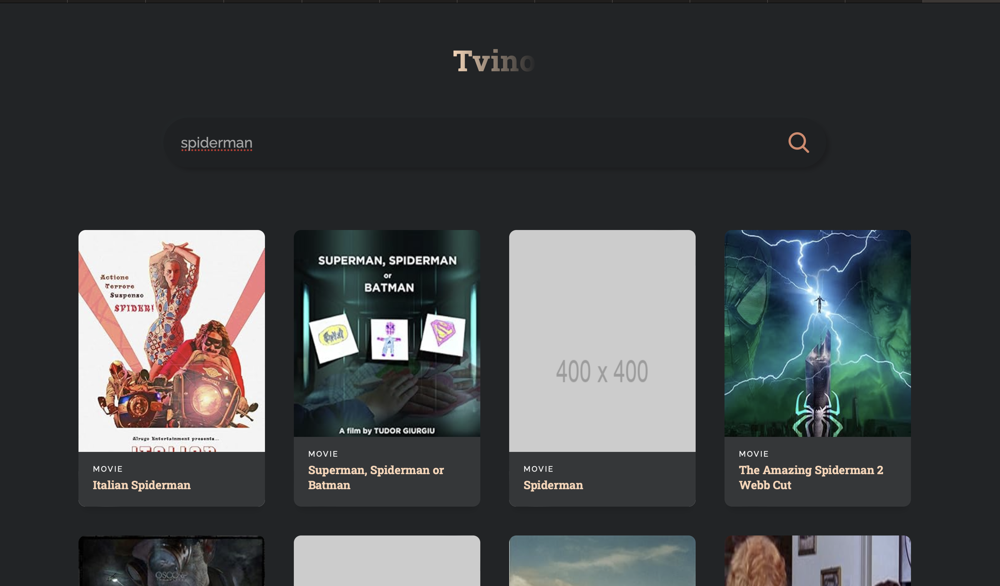

<h1>🎥 Streaming website</h1>

<h2>🎞️ Overview</h2>

<p>
    A streaming website showcasing a variety of movies and TV shows,
    built with ReactJS. The project focuses on core React concepts like 
    components and hooks, along with API integration to fetch and display 
    dynamic content.
</p>
<h2>⬇️ installation</h2>
<ol>
    <li>
        Clone the repository:
        <pre><code class="language-bash">git clone repository-url streamingWebsite</code></pre>
        <pre><code class="language-bash">cd streamingWebsite</code></pre>
    </li>
        <li>
        Install dependencies:
        <pre><code class="language-bash">npm install</code></pre>
    </li>
    <li>
        Start the project:
        <pre><code class="language-bash">npx start</code></pre>
    </li>
</ol>
<h2>🛠️ Usage</h2>
    <p>Open the browser </p>
    <pre><code class="language-bash">http://localhost:3000</code></pre>

## 💡 Learned Concepts
* **ReactJS components**:
   ```javascript
        function MovieCard({movie}){
            console.log('movie = ', movie)
            return (
                <>
                <div className='movie'>
                            <div>
                                <p>{movie.Year}</p>
                            </div>
                            <div>
                                
                            </div>

                            <div>
                                <span>{movie.Type}</span>
                                <h3>{movie.Title}</h3>
                            </div>
                        </div>
                </>
            )
        }
        
    ```

* **ReactJS Hooks**:
    ```javascript
        const [movies, setMovies] = useState([]);
        const [search, setSearch] = useState('');
     ```
    ```javascript
        useEffect(()=>{
            searchMovies()
        }, [])
    ```

<h2>📑 Documentation </h2>

[ReactJs](https://react.dev/learn)
<h2>💬 Tools and languages</h2>
<a href="https://react.dev" target="_blank" ></a>
<a href="https://www.npmjs.com" target="_blank" ></a>
<a href="https://nodejs.org/en" target="_blank" ></a>
<a href="https://developer.mozilla.org/en-US/docs/Web/HTML" target="_blank" ></a>
<a href="https://developer.mozilla.org/en-US/docs/Web/CSS" target="_blank" ></a>

<br />
<br />


<h2>👨‍💻 Happy coding</h2>

